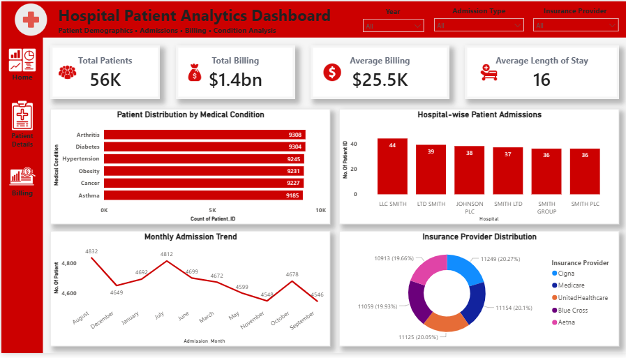
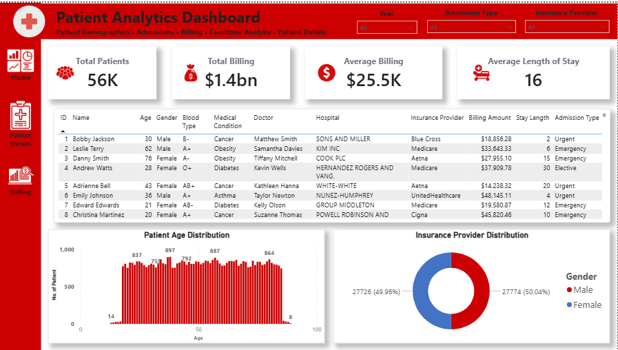
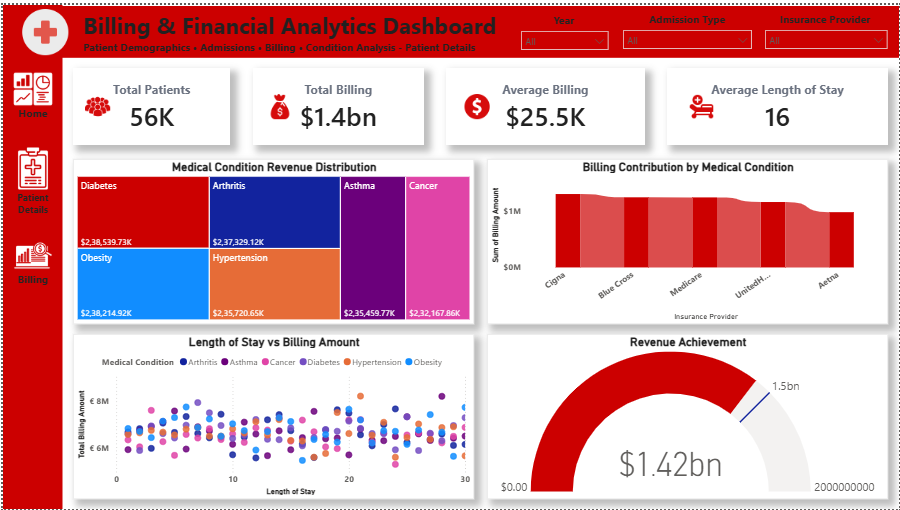
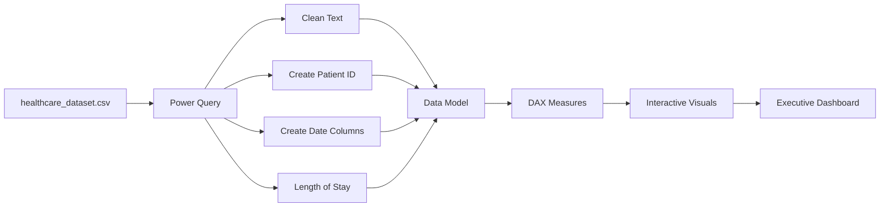

# 🏥 Hospital Patient Analytics Dashboard

<<<<<<< HEAD
# 📊 Power BI \| Healthcare Analytics \| Executive Dashboard Portfolio Project


=======

# 📊 Power BI \| Healthcare Analytics \| Executive Dashboard Portfolio Project

>>>>>>> 4b0add4ff74fa59bbe08a55b47d92d8548d34b98


------------------------------------------------------------------------

# 📑 Table of Contents

1.  Executive Summary
2.  Business Problem
3.  Solution
4.  Dashboard Preview
5.  Interactive Gallery
6.  Features
7.  Dashboard Pages
8.  KPI Measures
9.  DAX Explained
10. Data Dictionary
11. ETL Workflow
12. Project Structure
13. Skills Demonstrated
14. Resume Description
15. Future Improvements

------------------------------------------------------------------------

# 📈 Executive Summary

This project demonstrates an end-to-end Power BI analytics solution that
converts raw healthcare data into executive-level insights through
interactive dashboards. It showcases data preparation with Power Query,
KPI development using DAX, and business-focused visual storytelling.

------------------------------------------------------------------------

# 📊 Business Problem

Healthcare organizations generate large volumes of patient, admission,
billing, and insurance data. Without interactive reporting it becomes
difficult to:

-   Track patient admissions
-   Monitor billing performance
-   Compare hospitals
-   Understand medical condition trends
-   Analyze insurance provider contribution

------------------------------------------------------------------------

# ✅ Solution

A three-page interactive Power BI report was developed featuring:

-   Executive Dashboard
-   Patient Analytics
-   Billing & Financial Analytics

Each page includes synchronized slicers, KPI cards, and business-focused
visualizations.

------------------------------------------------------------------------

# 📸 Dashboard Preview

## 🏠 Executive Dashboard



## 👨‍⚕️ Patient Analytics



## 💰 Billing Analytics


<<<<<<< HEAD

------------------------------------------------------------------------

# 🎨 Clickable Dashboard Gallery

  Dashboard             Preview
  --------------------- ------------------------------------------------
  Executive Dashboard   [Open](Screenshots/Main_Page_Dashboard.png)
  Patient Analytics     [Open](Screenshots/Patient_Analytics_Page.png)
  Billing Analytics     [Open](Screenshots/Billing_Analytics_Page.png)
=======
>>>>>>> 4b0add4ff74fa59bbe08a55b47d92d8548d34b98

------------------------------------------------------------------------

# ✨ Features

-   Interactive slicers
-   Navigation buttons
-   KPI cards
-   Treemap
-   Waterfall
-   Gauge
-   Scatter Chart
-   Bar Chart
-   Column Chart
-   Donut Chart
-   Line Chart
-   Responsive report layout

------------------------------------------------------------------------

# 📊 Dashboard Pages

## Page 1

Executive overview with KPIs and operational insights.

## Page 2

Detailed patient exploration with searchable records and demographic
analysis.

## Page 3

Financial analysis highlighting revenue contribution and billing
performance.

------------------------------------------------------------------------

# 🧠 KPI Measures

``` dax
Total Patients =
COUNT('healthcare_dataset'[Patient_ID])

Total Billing =
SUM('healthcare_dataset'[Billing Amount])

Average Billing =
AVERAGE('healthcare_dataset'[Billing Amount])

Average Length of Stay =
AVERAGE('healthcare_dataset'[Length_of_Stay_Days])
```

------------------------------------------------------------------------

# 🧠 DAX Measures Explained

  Measure                  Business Purpose
  ------------------------ ----------------------------------
  Total Patients           Number of admitted patients
  Total Billing            Total healthcare revenue
  Average Billing          Average patient billing amount
  Average Length of Stay   Average hospitalization duration

------------------------------------------------------------------------

# 📋 Data Dictionary

  Column                Description
  --------------------- ---------------------------------
  Patient_ID            Unique patient identifier
  Name                  Patient name
  Age                   Patient age
  Gender                Gender
  Medical Condition     Diagnosis
  Hospital              Hospital name
  Insurance Provider    Insurance company
  Billing Amount        Total patient billing
  Admission Type        Emergency/Urgent/Elective
  Date of Admission     Admission date
  Discharge Date        Discharge date
  Length_of_Stay_Days   Calculated hospitalization days

------------------------------------------------------------------------

# 🔄 ETL Workflow



------------------------------------------------------------------------

# ⭐ Skills Demonstrated

-   Power BI Dashboard Design
-   Data Modeling
-   Power Query ETL
-   DAX Measures
-   KPI Development
-   Executive Reporting
-   Data Visualization
-   Business Intelligence
-   Interactive Filtering
-   Dashboard Navigation
-   Analytical Storytelling

------------------------------------------------------------------------

# 💼 Resume Ready Description

**Hospital Patient Analytics Dashboard \| Power BI**

Developed a three-page interactive healthcare analytics solution using
Power BI. Performed ETL in Power Query, created DAX measures for
executive KPIs, designed interactive dashboards with synchronized
slicers and navigation, and delivered actionable insights into patient
demographics, admissions, insurance providers, and billing performance.

------------------------------------------------------------------------

# 📁 Project Structure

``` text
Hospital Patient Analytics Dashboard
│
├── Assets
├── Screenshots
│   ├── Page1_Executive.png
│   ├── Page2_PatientAnalytics.png
│   └── Page3_BillingAnalytics.png
├── healthcare_dataset.csv
├── Hospital_Patient_Analytics_Dashboard.pbix
└── README.md
```

------------------------------------------------------------------------

# 🚀 Future Improvements

-   Power BI Service deployment
-   Mobile layout
-   Row Level Security (RLS)
-   Drill-through pages
-   AI Insights
-   Forecasting

------------------------------------------------------------------------

# 👨‍💻 Author

**Dushyant V**

⭐ If you found this project helpful, consider starring the repository.
